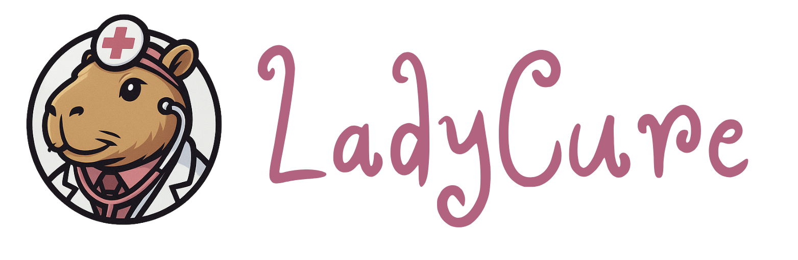
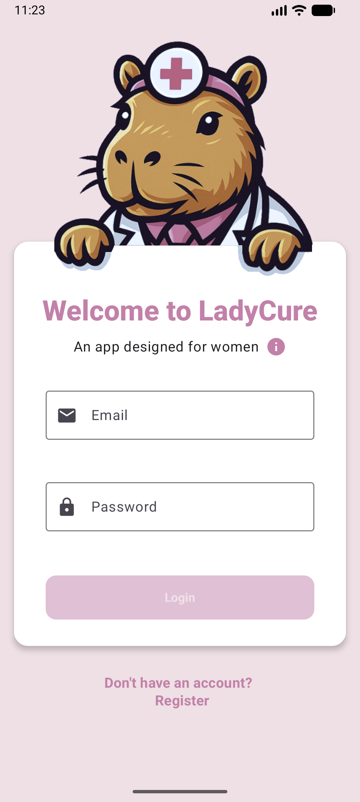
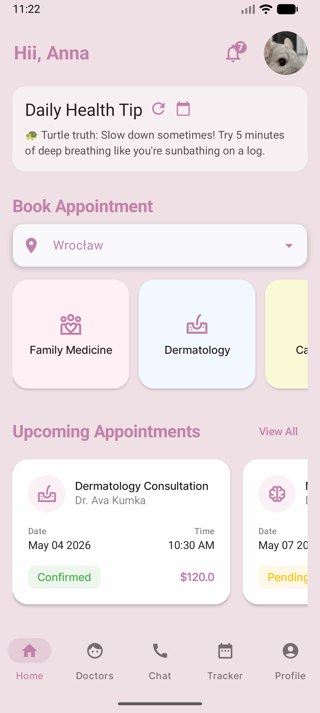
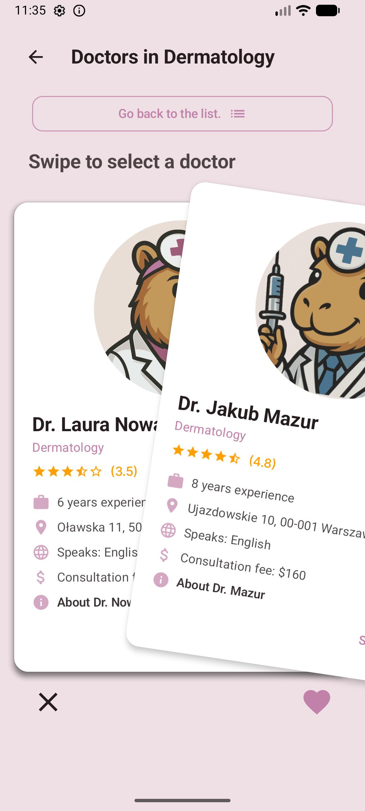
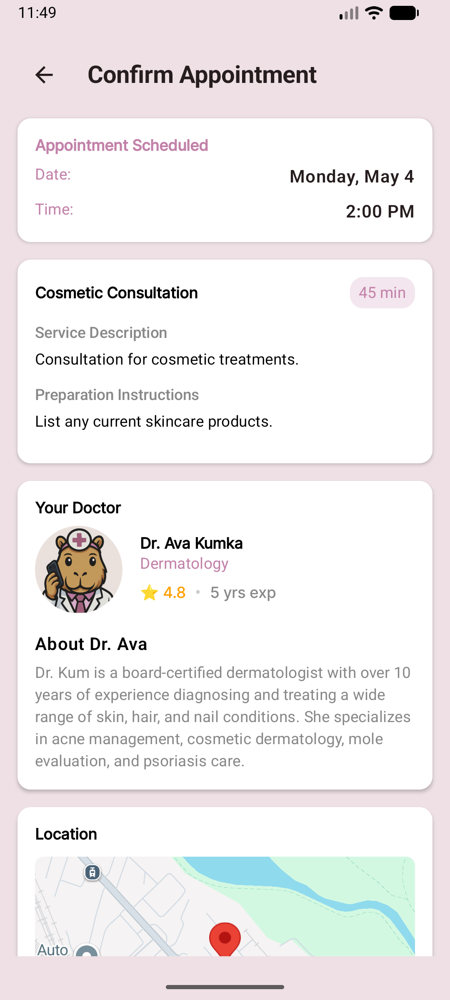
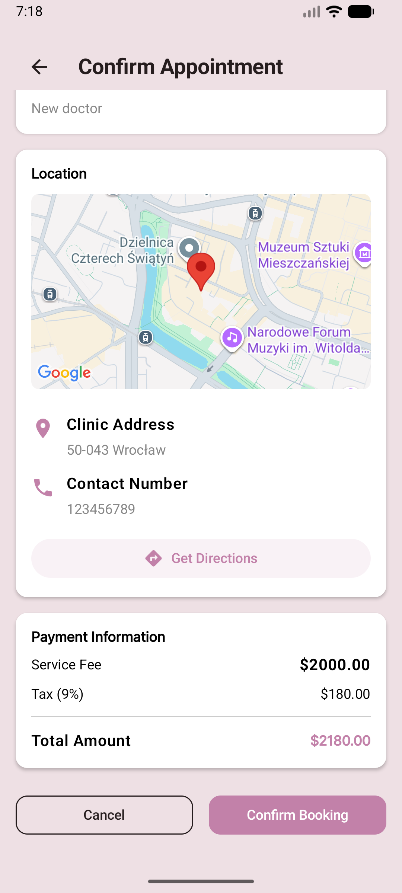
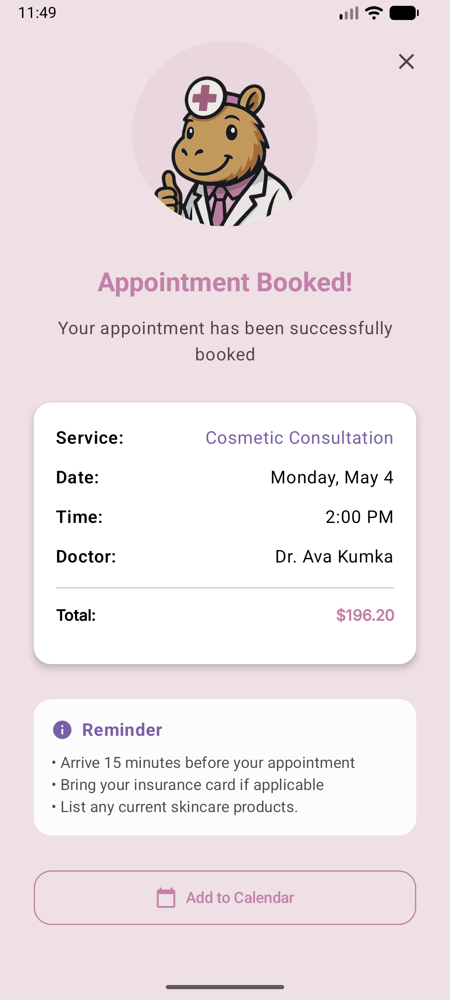
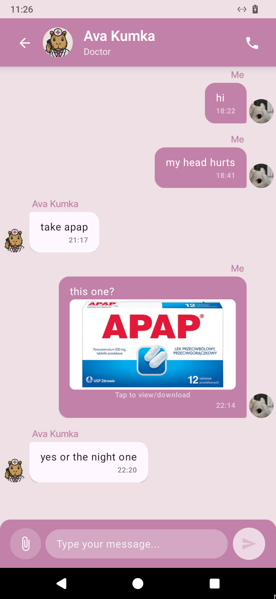
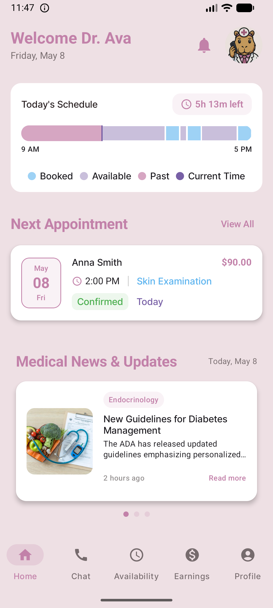

<div align="center">



# LadyCure

**A full-featured medical e-clinic platform for Android, built with Kotlin and Jetpack Compose as a
university final project at Wroclaw University of Science and Technology**

[](https://kotlinlang.org/)
[](https://developer.android.com/jetpack/compose)
[](https://firebase.google.com/)
[](https://developer.android.com/)

</div>

Designed with women's health and comfort in mind. Unlike
clinical, sterile medical apps, LadyCure combines full e-clinic functionality with a warm,
approachable aesthetic. It uses a soft theme, friendly design, and a capybara mascot that makes
healthcare feel less intimidating.

The platform supports three distinct user roles: Patient, Doctor, and Administrator. Each with a
dedicated interface. The project follows a clean architecture with repository, domain, and
presentation layers.

## Demo

[Full screenshot gallery](screenshots/)

<p align="center">
  
  
  
  

</p>

<p align="center">
  
  
  
  

</p>

## Features

### Patient

- Biometric login (fingerprint / face / device PIN) with password fallback
- Home dashboard with upcoming appointments, daily health tips, and specialty-based booking entry
  points
- Doctor discovery by specialty with a swipe-to-like interface (swipe right to book, left to skip)
  and free-text search
- Multi-step appointment booking: select service and type, choose date and time slot, upload
  referral PDF if required, confirm with embedded Google Maps location and payment summary
- Add booked appointments to device calendar
- Reschedule appointments with a side-by-side before/after comparison view
- Real-time chat with doctors: text, image attachments (tap to expand, download), and file
  attachments
- In-app notification feed: appointment confirmations, reminders, cancellations, and post-visit
  feedback requests
- Period tracker: log cycle dates, symptoms, and notes with cycle length prediction based on history
- Profile management with photo upload

### Doctor

- Dashboard with a live timeline visualization of the day (booked, available, and past slots with a
  current-time marker)
- Appointment confirmation and notes editing directly from the dashboard
- Earnings analytics: bar and pie charts for income over time, breakdown by appointment type,
  filtered by week/month/year
- Availability management: set working hours per day, create recurring weekly patterns, copy
  schedule forward up to 3 months
- Role-aware appointments list with patient names, status filters, and inline confirmation
- Chat with patients (same real-time chat as patient view)

### Admin

- Analytics dashboard: total users, active doctors, pending applications, user growth charts, age
  distribution, application status breakdown
- Doctor application review: approve, reject, or request more information with optional comments;
  view uploaded license and diploma documents
- Doctor management: edit all profile fields including specialty, availability, rating, languages,
  and biography; change roles
- User management: view, edit, and manage all patient accounts

## Architecture

LadyCure follows **Clean Architecture** principles with clear separation of concerns (it tries):

```
com.example.ladycure/
├── data/
│   └── repository/          # Data layer: Firebase abstraction
│       ├── AuthRepository
│       ├── AppointmentRepository
│       ├── ChatRepository
│       ├── DoctorRepository
│       ├── NotificationRepository
│       └── ...
├── domain/
│   ├── model/               # Domain models (Appointment, Doctor, Message...)
│   └── RegisterUseCase      # Business logic use cases
├── presentation/            # UI layer
│   ├── admin/               # Admin screens + ViewModels
│   ├── booking/             # Full booking flow + ViewModels
│   ├── chat/                # Real-time chat
│   ├── doctor/              # Doctor dashboard
│   ├── home/                # Patient home, doctor list, profile
│   └── ...
└── ui/theme/                # Design system (colors, typography, responsive dimens)
```

### Responsive Layout System

All screens use a custom `rememberResponsiveDimens()` utility that scales layout values
proportionally to the current screen size, ensuring consistent UI across all Android devices.

### Firestore Performance Optimization

Rather than querying the full appointments collection, the app maintains lightweight summary
documents per user under `appointmentSummaries/{month}/items` and a dedicated `upcoming` bucket.
Full appointment documents are fetched only on demand. Firebase Cloud Functions keep summaries
synchronized automatically.

## Backend

### Firebase Cloud Functions (TypeScript)

| Function                               | Trigger               | Description                                                                                       |
|----------------------------------------|-----------------------|---------------------------------------------------------------------------------------------------|
| `createAppointmentSummary`             | Firestore onCreate    | Creates summary entries for both patient and doctor on new appointment                            |
| `updateAppointmentSummaries`           | Firestore onUpdate    | Keeps summaries in sync when appointment status or time changes                                   |
| `sendAppointmentConfirmedNotification` | Firestore onUpdate    | Sends FCM push when doctor confirms an appointment                                                |
| `sendAppointmentCancelledNotification` | Firestore onUpdate    | Notifies both parties on cancellation                                                             |
| `sendUpcomingAppointmentReminders`     | Scheduled every 5 min | Sends 1-hour and 5-minute reminders; auto-cancels unconfirmed appointments approaching start time |
| `cleanOldAvailabilities`               | Scheduled daily       | Removes past availability slots; moves past appointments from upcoming to monthly archive         |

## Tech Stack

| Layer                | Technology                                            |
|----------------------|-------------------------------------------------------|
| Language             | Kotlin                                                |
| UI                   | Jetpack Compose, Material 3                           |
| Architecture         | Repository pattern, ViewModel, UseCase                |
| Authentication       | Firebase Auth with biometric integration              |
| Database             | Cloud Firestore                                       |
| Storage              | Firebase Storage                                      |
| Push Notifications   | Firebase Cloud Messaging                              |
| Backend              | Firebase Cloud Functions (TypeScript)                 |
| Maps                 | Google Maps SDK for Compose, Geocoder                 |
| Image Loading        | Coil                                                  |
| Navigation           | Jetpack Navigation Compose                            |
| Dependency Injection | Hilt                                                  |
| Charts               | Custom Canvas-drawn BarChart and PieChart composables |

## Setup

### Prerequisites

- Android Studio Hedgehog or newer
- Android SDK 26+
- A Firebase project with Firestore, Auth, Storage, FCM, and Cloud Functions enabled

### Installation

1. Clone the repository

```bash
git clone https://github.com/wlaszkiewicz/LadyCure.git
```

2. Add your `google-services.json` to `app/`
3. Add your Maps API key to `local.properties`:

```
MAPS_API_KEY=your_key_here
```

4. Build and run:

```bash
./gradlew assembleDebug
```

## Known Limitations and Future Work

The project prioritized delivering complete functionality across all three user roles. Areas
identified for future improvement:

- Unit and integration tests
- CI/CD pipeline
- Full ViewModel coverage for all screens (some screens currently instantiate repositories directly)
- Theme switching (infrastructure exists via `ThemeManager` but toggle is not yet surfaced in the
  UI)
- Written reviews in addition to star ratings
- Real-time medical news feed for doctors (currently placeholder data)

## Project Context

Developed as a final project for the Mobile Application Development course at Wroclaw University of
Science and Technology, Faculty of Fundamental Problems of Technology.

**Team:**

| Developer            | Contribution                                                                                                               |
|----------------------|----------------------------------------------------------------------------------------------------------------------------|
| Weronika Laszkiewicz | Architecture, Cloud Functions, booking flow, notifications, admin panel, doctor dashboard, performance optimization, UI/UX |
| Kinga Stopyra        | Registration flow, chat, UI/UX                                                                                             |
| Magdalena Mertuszka  | Period tracker, assets                                                                                                     |

<div align="center">
Made with blood and tears

⠀⠀⠀⠀⠀⠀⠀⠀⠀⠀⠀⠀⠀⠀⠀⠀⠀⠀⠀⠀⠀⠀⠀⠀⠀⠀⠀⠀⠀⠀⠀⠀⠀⠀⠀⠀⠀⠀⠀⠀⠀⠀⠀⣀⣀⣀⠀⠀⠀⠀⠀⠀⠀⠀⠀⠀⠀⠀⠀⠀⠀⠀⠀⠀⠀⠀⠀⠀⠀⠀⠀
⠀⠀⠀⠀⠀⠀⠀⠀⠀⠀⠀⠀⠀⠀⠀⠀⠀⠀⠀⠀⠀⠀⠀⠀⠀⠀⠀⠀⠀⠀⠀⠀⠀⠀⠀⠀⠀⣀⣀⣀⣀⣴⣿⣿⣿⣾⣤⠀⠀⠀⠀⠀⠀⠀⠀⠀⠀⠀⠀⠀⠀⠀⠀⠀⠀⠀⠀⠀⠀⠀⠀
⠀⠀⠀⠀⠀⠀⠀⠀⠀⠀⠀⠀⠀⠀⠀⠀⠀⠀⠀⠀⢀⣠⣀⡄⣴⣤⠦⣶⢴⣪⡷⠶⡶⢛⣿⢛⡝⣩⢿⠗⣋⡽⢋⣿⣿⣿⣟⣧⣄⠀⠀⠀⠀⠀⠀⠀⠀⠀⠀⠀⠀⠀⠀⠀⠀⠀⠀⠀⠀⠀⠀
⠀⠀⠀⠀⠀⠀⠀⠀⠀⠀⠀⠀⠀⠀⠀⠀⠀⠀⢀⢶⢟⡯⢛⢚⢋⡶⡹⣑⣪⠞⣢⠪⡲⠋⢔⠑⣈⠥⠂⠀⢅⣰⣷⣯⡿⢿⣿⣿⡋⡧⣀⠀⠀⠀⠀⠀⠀⠀⠀⠀⠀⠀⠀⠀⠀⠀⠀⠀⠀⠀⠀
⠀⠀⠀⠀⠀⠀⠀⠀⠀⠀⠀⠀⠀⣀⣀⣤⣖⢞⠍⢔⠏⠀⢋⢁⠵⣢⢞⡮⠗⣊⣢⣚⠈⠀⠀⠀⠒⠀⠄⣁⠢⠀⢿⣿⣿⣷⣝⢿⣿⣏⣾⣧⣄⠀⠀⠀⠀⠀⠀⠀⠀⠀⠀⠀⠀⠀⠀⠀⠀⠀⠀
⠀⠀⠀⠀⠀⠀⠀⠀⠀⣀⣴⠖⢛⡩⠛⢁⡔⠅⠞⠫⠀⡔⣡⠾⣛⣽⣿⠺⠛⠛⠽⣵⣤⣜⠠⠁⠄⠀⠀⠂⢀⣁⠈⣿⣿⣿⢿⡞⣿⣿⢸⢯⣟⣆⠀⠀⠀⠀⠀⠀⠀⠀⠀⠀⠀⠀⠀⠀⠀⠀⠀
⠀⠀⠀⠀⠀⠀⣠⣴⠾⠟⢣⢞⠏⡠⠔⡤⠀⠀⣀⠤⣟⡬⣾⣪⣟⣫⣤⣥⣄⣉⣭⣖⣢⡦⠐⠁⡈⠁⠀⠀⠀⡀⠐⣿⣿⣯⣾⣽⣿⣷⣿⣳⡟⣾⣷⠄⠀⠀⠀⠀⠀⠀⠀⠀⠀⠀⠀⠀⠀⠀⠀
⠀⠀⠀⢀⣴⡿⣟⠋⠌⠔⢑⠄⢂⠀⠋⡠⠚⠉⠀⠉⠀⡜⢻⠷⣿⣿⣿⣿⣿⣿⠟⣡⠾⠂⢍⠀⠄⠀⢠⠄⣠⠥⣀⢼⣿⣿⣿⣿⠿⡛⢷⢾⣿⣮⡿⣓⠄⠀⠀⠀⠀⠀⠀⠀⠀⠀⠀⠀⠀⠀⠀
⠀⢀⣴⣿⣷⢺⣁⢈⠅⠨⠀⠤⠨⠐⠒⠀⠀⠈⠀⢤⠀⠁⠦⣳⢦⣉⣉⣉⣩⣰⠿⠓⠊⠀⡐⣠⠉⠀⠐⠠⠔⠨⣁⠪⡡⠠⣐⠬⣲⣫⣜⡓⣯⣻⣯⣻⣷⡀⠀⠀⠀⠀⠀⠀⠀⠀⠀⠀⠀⠀⠀
⠀⡾⣿⣾⣿⣶⢕⡢⠊⠐⠀⡈⢀⠐⢀⣁⡨⠉⠄⠀⠉⢑⠒⡤⠠⠍⡛⣡⠈⠤⡁⢁⠒⠡⣩⠅⣓⡴⢂⠗⣸⢫⣔⢖⠢⡀⠪⣙⠳⣎⢗⣯⣾⣷⢧⣫⣻⣝⠂⠀⠀⠀⠀⠀⠀⠀⠀⠀⠀⠀⠀
⢸⡗⢿⡽⣿⡫⣉⠀⡼⠡⢁⡀⠄⣀⣀⠠⠉⠀⠂⡉⠟⠶⢤⣀⠉⡈⡑⠢⠀⠲⢐⠠⢘⠁⢂⠬⣡⣊⢔⡤⣑⠪⣘⢕⠤⣑⡠⢄⡑⣌⠲⢷⡪⡼⣖⣯⢷⣽⡦⠀⠀⠀⠀⠀⠀⠀⠀⠀⠀⠀⠀
⢸⣿⣬⣧⡟⠥⠔⣀⢘⠦⠑⡪⢄⡠⡦⣉⡘⠑⡶⣨⢜⡘⢂⠵⡥⡀⠵⢦⡔⣫⣔⡱⣅⠛⣵⠭⣒⢭⡋⣸⡵⢗⣝⢳⣜⠢⡫⡢⡑⢌⢝⢦⣽⠾⡶⡝⢷⣍⢿⡇⠄⠀⠀⠀⠀⠀⠀⠀⠀⠀⠀
⠘⣿⣿⣿⣿⣦⠁⠆⢬⣆⠪⡍⣶⣷⢷⣿⣿⣿⣿⣾⣿⣾⣑⣮⣞⣝⡮⢥⢏⠶⣵⡩⣜⠫⢗⡥⣃⢍⠚⢔⡽⣼⡸⣙⢸⡢⡈⠪⡪⣎⢷⣍⣻⣳⣽⢾⢮⣿⣿⡿⡀⠀⠀⠀⠀⠀⠀⠀⠀⠀⠀
⠀⢻⣿⣿⣿⣕⢦⡈⣕⣝⣦⡛⢿⣫⢾⣍⡻⢙⠢⢅⡻⢝⣷⣗⢪⢝⢯⢷⢷⡩⣲⣽⡮⣿⣿⣝⡪⢑⢵⢤⡹⢌⡫⣪⡑⢕⢌⠣⣘⢮⣳⣝⢮⢷⡽⣯⣷⣿⡟⣡⣷⡀⠀⠀⠀⠀⠀⠀⠀⠀⠀
⠀⡼⣿⣿⣿⣆⣂⠙⣯⡾⡮⣻⠽⣌⠲⡌⠡⢗⠸⣆⠠⠹⢌⠲⡙⢳⣄⠝⣜⠳⣴⡼⣍⡣⣳⡭⠪⡶⢕⢵⢮⠳⣵⢭⡾⢕⣕⣷⠙⣦⡻⣝⣫⣳⣿⣿⡿⢋⣴⣿⣿⣷⡀⠀⠀⠀⠀⠀⠀⠀⠀
⠀⠀⠸⣿⣯⣼⣿⣧⣿⣷⣮⡘⣷⣼⢳⡼⣧⢬⣑⢽⣷⣝⢶⣽⣜⡶⡬⣿⣢⡙⢎⢾⣬⢝⢮⣘⢆⢎⢮⡣⣣⣱⠺⣧⡹⣯⢮⢿⣷⡙⣷⣿⣿⣿⡿⠋⣠⣾⣿⣿⣿⣿⣷⠀⠀⠀⠀⠀⠀⠀⠀
⠀⠀⠌⠝⢿⣿⣿⣿⣿⣿⣿⣻⣮⣿⣽⣿⣿⣵⢿⣷⣮⣯⣳⣿⣻⣿⣻⣞⣿⣾⣻⢦⣯⣷⣥⣫⡖⡕⡝⢗⢽⣯⣷⣜⣷⣏⣿⣷⣽⣿⣿⡿⠟⠈⣠⣾⣿⣿⣿⣿⣿⣿⣿⣷⡀⠀⠀⠀⠀⠀⠀
⠀⠈⠀⠀⠈⠈⠻⠻⣿⣿⣿⣿⣿⣿⣿⣿⣿⣿⣿⣿⣿⣿⣿⣿⣿⣿⢿⣾⣿⣿⣷⣿⣿⢷⡿⣷⣞⣿⣼⣮⣷⣵⡽⣿⣷⣽⣷⣿⣿⡿⢫⠈⣠⣾⣿⣿⣿⣿⣿⣿⣿⣿⣿⣿⣿⣄⠀⠀⠀⠀⠀
⠀⠀⠀⠀⠀⠀⠀⠀⠈⠛⠛⠛⠛⠟⠻⠛⠿⢿⢿⣿⣿⣿⣿⣿⣿⣿⣿⣿⣿⣿⣿⣿⣿⣷⣿⣿⣻⡷⣳⣇⣿⣾⣝⣾⣽⣿⣿⡿⡻⠚⣡⣼⣿⣿⣿⣿⣿⣿⣿⣿⣿⣿⣿⣿⣿⣿⣦⡀⠀⠀⠀
⠀⠀⠀⠀⠀⠀⠀⠀⠀⠀⠀⠀⠀⠀⠀⠀⠀⠀⠀⠀⠀⠈⠏⠸⠉⠿⢿⣿⣿⣿⣿⣿⣿⣿⣿⣾⣿⣏⢿⣿⡾⣹⣾⣾⣿⡿⣉⠎⠀⣶⣿⣿⣿⣿⣿⣿⣿⣿⣿⣿⣿⣿⣿⣿⣿⣿⣿⣷⡀⠀⠀
⠀⠀⠀⠀⠀⠀⠀⠀⠀⠀⠀⠀⠀⠀⠀⠀⠀⠀⠀⠀⠀⠀⠀⠀⠀⠀⠀⠙⣿⣿⣿⣿⣿⣿⣿⣿⣿⡿⣜⣿⣼⣿⣿⣿⡿⠕⠁⣠⣾⣿⣿⣿⣿⣿⣿⣿⣿⣿⣿⣿⣿⣿⣿⣿⣿⣿⣿⣿⣿⣦⠀
⠀⠀⠀⠀⠀⠀⠀⠀⠀⠀⠀⠀⠀⠀⠀⠀⠀⠀⠀⠀⠀⠀⠀⠀⠀⠀⠀⠀⢹⣿⣿⣿⣿⣿⣿⣿⣿⣿⣧⣿⣿⡿⡫⠋⠀⣠⣾⣿⣿⣿⣿⣿⣿⣿⣿⣿⣿⣿⣿⣿⣿⣿⣿⣿⣿⣿⣿⣿⣿⣿⣷
⠀⠀⠀⠀⠀⠀⠀⠀⠀⠀⠀⠀⠀⠀⠀⠀⠀⠀⠀⠀⠀⠀⠀⠀⠀⠀⣠⠲⢚⠻⢿⣿⣿⣿⣿⣿⣿⣷⣿⣛⠗⠋⠀⣠⣾⣿⣿⣿⣿⣿⣿⣿⣿⣿⣿⣿⣿⣿⣿⣿⣿⣿⣿⣿⣿⣿⣿⣿⣿⣿⣿
⠀⠀⠀⠀⠀⠀⠀⠀⠀⠀⠀⠀⠀⠀⠀⠀⠀⠀⠀⠀⠀⠀⠀⣠⣴⡾⡊⠁⡀⣜⣣⣾⣾⣿⣿⣿⠯⠷⠋⠀⢀⣠⣾⣿⣿⣿⣿⣿⣿⣿⣿⣿⣿⣿⣿⣿⣿⣿⣿⣿⣿⣿⣿⣿⣿⣿⣿⣿⣿⣿⣿
⠀⠀⠀⠀⠀⠀⠀⠀⠀⠀⠀⠀⠀⠀⠀⠀⠀⠀⠀⠀⢀⣴⣿⢿⡏⠦⠁⣰⡱⢮⣷⣿⣿⠿⢋⠄⠈⠀⢀⣠⣿⣿⣿⣿⣿⣿⣿⣿⣿⣿⣿⣿⣿⣿⣿⣿⣿⣿⣿⣿⣿⣿⣿⣿⣿⣿⣿⣿⣿⣿⡇
⠀⠀⠀⠀⠀⠀⠀⠀⠀⠀⠀⠀⠀⠀⠀⠀⠀⠀⠀⣰⣿⠟⠁⣼⣏⠀⡰⢆⡟⣻⣿⣿⠡⠂⠀⠀⠀⣰⣿⣿⣿⣿⣿⣿⣿⣿⣿⣿⣿⣿⣿⣿⣿⣿⣿⣿⣿⣿⣿⣿⣿⣿⣿⣿⣿⣿⣿⣿⣿⣿⠇
⠀⠀⠀⠀⠀⠀⠀⠀⠀⠀⠀⠀⠀⠀⠀⠀⠀⠀⢀⣿⠃⠀⢠⣿⠂⢀⠹⣢⣿⣿⠟⠁⠀⠀⠀⣠⣾⣿⣿⣿⣿⣿⣿⣿⣿⣿⣿⣿⣿⣿⣿⣿⣿⣿⣿⣿⣿⣿⣿⣿⣿⣿⣿⣿⣿⣿⣿⣿⣿⡿⠀
⠀⠀⠀⠀⠀⠀⠀⠀⠀⠀⠀⠀⠀⠀⠀⠀⠀⢠⡿⢁⠤⢶⣞⣥⣤⣤⣇⣳⡟⣡⡀⠀⠀⢀⣾⣿⣿⣿⣿⣿⣿⣿⣿⣿⣿⣿⣿⣿⣿⣿⣿⣿⣿⣿⣿⣿⣿⣿⣿⣿⣿⣿⣿⣿⣿⣿⣿⠟⠋⠀⠀
⠀⠀⠀⠀⠀⠀⠀⠀⠀⠀⠀⠀⠀⠀⠀⠀⢠⡿⠁⠀⣠⣾⠋⠢⡝⣯⢻⣿⡟⠉⠈⢆⣴⣿⣿⣿⣿⣿⣿⣿⣿⣿⣿⣿⣿⣿⣿⣿⣿⣿⣿⣿⣿⣿⣿⣿⣿⣿⣿⣿⣿⣿⣿⣿⣿⢋⠁⠀⠀⠀⠀
⠀⠀⠀⠀⠀⠀⠀⠀⠀⠀⠀⠀⠀⠀⠀⣠⡿⠁⢀⡾⠻⠃⠰⡱⢪⣱⣿⡟⠀⠀⣰⣿⣿⣿⣿⣿⣿⣿⣿⣿⣿⣿⣿⣿⣿⣿⣿⣿⣿⣿⣿⣿⣿⣿⣿⣿⣿⣿⣿⣿⣿⣿⣿⡿⠛⠁⠀⠀⠀⠀⠀
⠀⠀⠀⠀⠀⠀⠀⠀⠀⠀⠀⠀⠀⠀⠀⣿⡇⠰⢫⠸⡁⡈⢶⡙⣵⣿⣿⠀⣠⣾⣿⣿⣿⣿⣿⣿⣿⣿⣿⣿⣿⣿⣿⣿⣿⣿⣿⣿⣿⣿⣿⣿⣿⣿⣿⣿⣿⣿⣿⣿⣿⠟⠉⠀⠀⠀⠀⠀⠀⠀⠀
⠀⠀⠀⠀⠀⠀⠀⠀⠀⠀⠀⠀⠀⠀⠀⣿⡇⠇⣳⠣⠈⠔⢣⣼⣿⣿⣧⣾⣿⣿⣿⣿⣿⣿⣿⣿⣿⣿⣿⣿⣿⣿⣿⣿⣿⣿⣿⣿⣿⣿⣿⣿⣿⣿⣿⣿⣿⣿⡿⠋⠁⠀⠀⠀⠀⠀⠀⠀⠀⠀⠀
⠀⠀⠀⠀⠀⠀⠀⠀⠀⠀⠀⠀⠀⠀⠀⣿⡇⢨⣇⠀⡁⢌⡿⣿⣿⣿⣿⣿⣿⣿⣿⣿⣿⣿⣿⣿⣿⣿⣿⣿⣿⣿⣿⣿⣿⣿⣿⣿⣿⣿⣿⣿⣿⣿⣿⠿⠛⠁⠀⠀⠀⠀⠀⠀⠀⠀⠀⠀⠀⠀⠀
⠀⠀⠀⠀⠀⠀⠀⠀⠀⠀⠀⠀⠀⠀⠀⢻⣧⢸⢧⠆⡰⢋⢾⣿⣿⣿⣿⣿⣿⣿⣿⣿⣿⣿⣿⣿⣿⠟⡛⣉⡍⡽⢭⣛⣿⣿⣿⣿⣿⣿⣿⠟⠛⠊⠁⠀⠀⠀⠀⠀⠀⠀⠀⠀⠀⠀⠀⠀⠀⠀⠀
⠀⠀⠀⠀⠀⠀⠀⠀⠀⠀⠀⠀⠀⠀⠀⢸⣿⢸⢯⡖⣁⢬⣾⣿⣿⣿⣿⣿⣿⣿⣿⣿⣿⣿⣿⣿⣯⡼⣱⣮⣾⢛⣷⣯⣿⣿⣿⣿⠿⠋⠀⠀⠀⠀⠀⠀⠀⠀⠀⠀⠀⠀⠀
⠀⠀⠀⠀⠀⠀⠀⠀⠀⠀⠀⠀⠀⠀⠀⠀⢿⡯⢷⣻⣴⣿⣿⣿⣿⣿⣿⣿⣿⣿⣿⣿⣿⣿⣿⣿⣿⣿⣿⣿⣿⣿⣿⣿⣽⠿⠋⠁⠀⠀⠀⠀⠀⠀⠀⠀⠀⠀⠀⠀⠀⠀⠀⠀
⠀⠀⠀⠀⠀⠀⠀⠀⠀⠀⠀⠀⠀⠀⠀⠀⠈⢻⢏⣿⣿⣿⣿⣿⣿⣿⣿⣿⣿⣿⣿⣿⣿⣿⣿⣿⣿⣿⣿⣿⣿⡿⠟⠋⠁⠀⠀⠀⠀⠀⠀⠀⠀⠀⠀⠀⠀⠀⠀⠀⠀⠀⠀⠀⠀⠀⠀⠀⠀⠀⠀
⠀⠀⠀⠀⠀⠀⠀⠀⠀⠀⠀⠀⠀⠀⠀⠀⠀⠈⢿⣿⣿⣿⣿⣿⣿⣿⣿⣿⣿⠿⠟⠻⠿⠿⠟⠛⠉⠉⠀⠀⠀⠀⠀⠀⠀⠀⠀⠀⠀⠀⠀⠀⠀⠀⠀⠀⠀⠀⠀⠀⠀⠀⠀⠀⠀⠀⠀⠀⠀⠀⠀
⠀⠀⠀⠀⠀⠀⠀⠀⠀⠀⠀⠀⠀⠀⠀⠀⠀⠀⠀⠈⠁⠀⠀⠀⠀⠀⠀⠀⠀⠀⠀⠀⠀⠀⠀⠀⠀⠀⠀⠀⠀⠀⠀⠀⠀⠀⠀⠀⠀⠀⠀⠀⠀⠀⠀⠀⠀⠀⠀⠀⠀⠀⠀⠀⠀⠀⠀⠀⠀⠀⠀
</div>